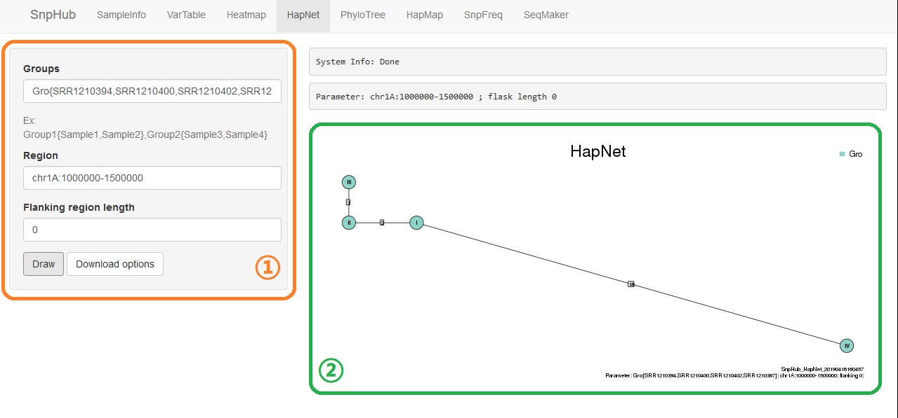
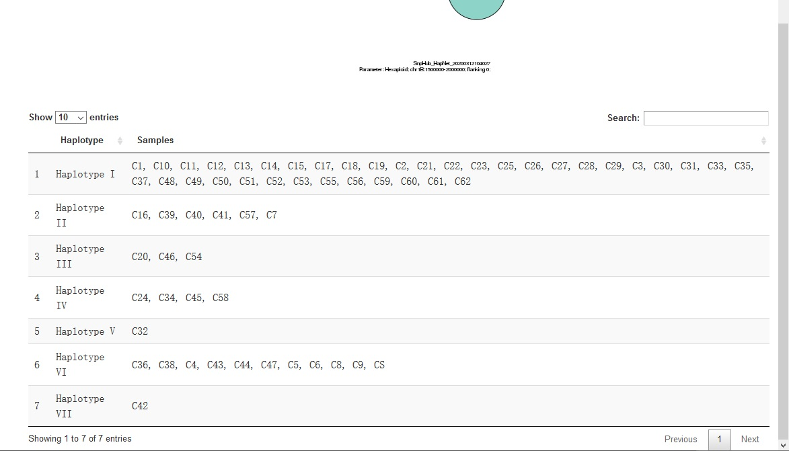
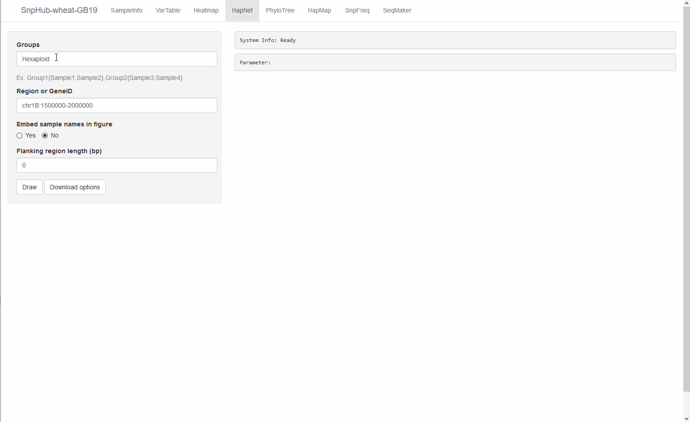

# HapNet, construct a haplotype network

Haplotype networks represent the relationships among the different haploid genotypes observed from the sample list based on package *[pegas](http://ape-package.ird.fr/pegas.html)*. You may find more information about haplotype network [here](http://phylonetworks.blogspot.com/2013/09/how-do-we-interpret-rooted-haplotype.html).

## Panel ① on the left provides several options:
- **Groups**: The textbox titled "Groups" inquiries a list of group IDs. Both `pre-defined group` and `user-defined group` styles are supported. For more details, please see [the overview section](channels).

- **Region or GeneID**: The textbox titled "**Region or GeneID** inquire the input for querying genomic regions. The input text shall be in form of `chr:from-to`. For example, `chr1A:1-100`. Also, gene name is acceptable.

- **Embed sample names in figure**: The option `Yes` presents "to draw the information of samples in each haplotype in figure".

- **Flanking region length**: When using the gene name as input, you may want to extend the regions. It is usually `0` bp in the box by default, indicating no flanking region is considered. If `2000` is provided in this input box, then the flanking regions in length of "2000bp" will be included for both upstream and downstream.

- **Draw**: Click for action when getting all options ready.

## Download Options

Click the **Download Options** button, and then you can select downloading format (`PNG` or `PDF`) of figure, and specify the width and height to appropriate presentation.

Then, click `Download` to download the figure.

## Details

A table containing the information of samples with haplotype groups will be shown under the plot on webpage.

## Demonstration

