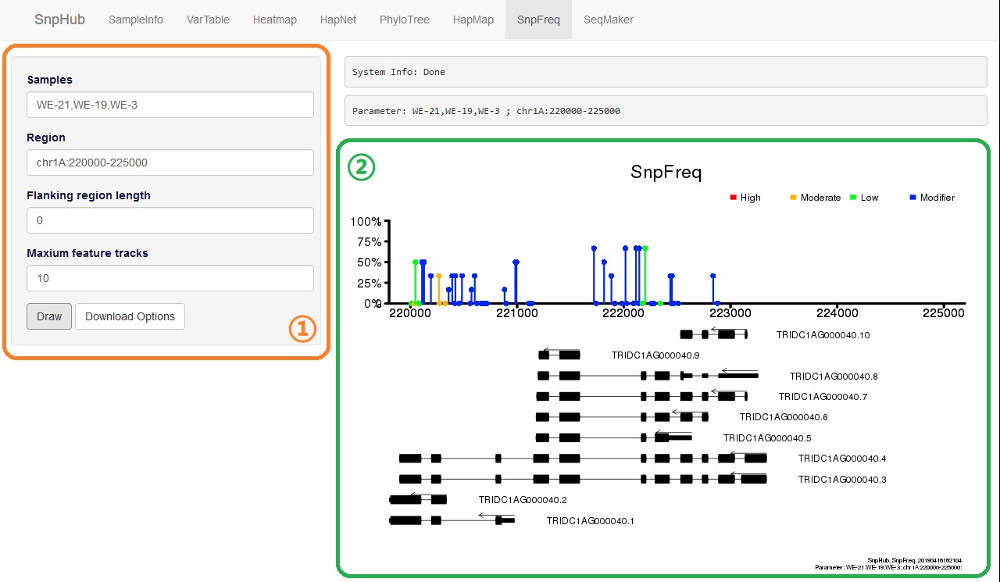
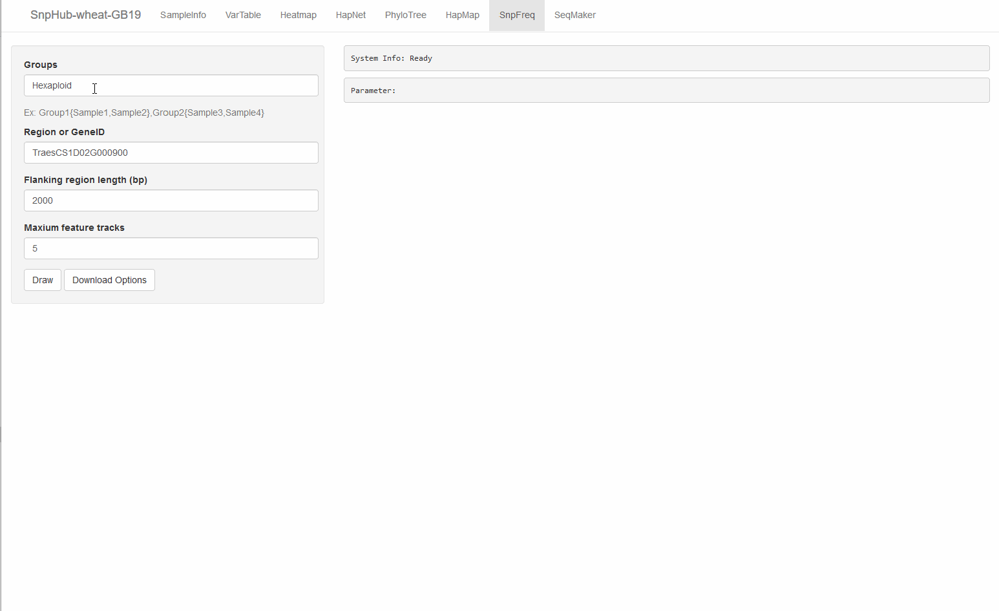

# SnpFreq, visualize variation frequency with gene tracks

The **`SnpFreq`** channel allows user to visualize the SNPs/INDELs and functional annotations along with the transcript-tracks. The lollipop graph is adopted to visualize the positions and frequencies of genomic variations to distinguish the low-frequency variants and un-detected variations.

Variants causing amino acid changes are annotated in different colors, including *missense variation*, *synonymous variant*, *frameshift variant*, *stop code gained/lost* and *splice region variants*. Transcripts in the same region are displayed as different tracks at the bottom, with annotations of the *exons*, *introns*, *CDSs* and *transcription directions*. Samples in different groups are summarized independently and visualized in different tracks, which can be useful for exploring the different frequencies of SNPs among groups.

## Parameters in panel ①
- **Groups**: The textbox titled "Groups" inquiries a list of group IDs. Both `pre-defined group` and `user-defined group` styles are supported. For more details, please see [the overview section](channels).

- **Region or GeneID**: The textbox titled "**Region or GeneID** inquire the input for querying genomic regions. The input text shall be in form of `chr:from-to`. For example, `chr1A:1-100`. Also, gene name is acceptable.

- **Flanking region length**: When using the gene name as input, you may want to extend the regions. It is usually `0` bp in the box by default, indicating no flanking region is considered. If `2000` is provided in this input box, then the flanking regions in length of "2000bp" will be included for both upstream and downstream.

- **Draw**: Click for action when getting all options ready.

## Download Options

Click the **Download Options** button, and then you can select downloading format (`PNG` or `PDF`) of figure, and specify the width and height to appropriate presentation.

Then, click `Download` to download the figure.

## Demonstration

