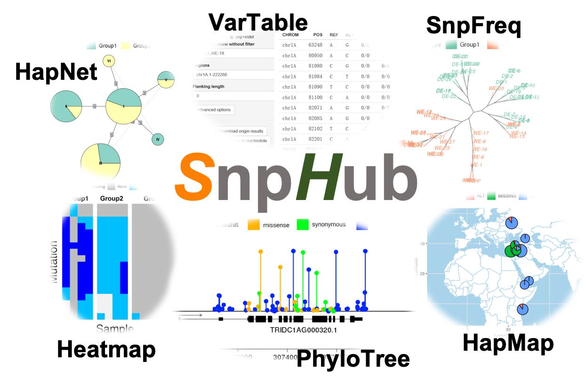

# About SnpHub

SnpHub is a lab-based server for retrieving, analyzing and visualizing the large-scale genomic variation data that be easily set up on any Linux server. Share this torturial with link [https://esctrionsit.github.io/snphub_tutorial/](https://esctrionsit.github.io/snphub_tutorial/)

The cost of high-throughput sequencing is rapidly decreasing, allowing researchers to investigate genomic variations across hundreds or even thousands of samples in the post-genomic era. The management and exploration of these large-scale genomic variation data require programming skills. SnpHub is designed to lower such barrier.

By using SnpHub, you can exporting region-specific variation tables, visualizing genotypes in matrix, constructing haplotype network, visualizing sample distance in a local region, visualizing the SNP annotation in lollipop format, visualizing the genotypes geographically and creating consensus sequence for individuals in a much easier way that requires few knowledge and ability of computer, even for the administrator who would to deploy SnpHub.

## Citation

Wenxi Wang*, Zihao Wang*, Xintong Li, Zhongfu Ni, Zhaorong Hu, Mingming Xin, Huiru Peng, Yingyin Yao, Qixin Sun, Weilong Guo #. (2020) [SnpHub: an easy-to-set-up web server framework for exploring large-scale genomic variation data in the post-genomic era with applications in wheat](https://academic.oup.com/gigascience/article/9/6/giaa060/5851733) , GigaScience, 9(6):giaa060. (# corresponding author; * Joint First Authors)
DOI:[doi:10.1093/gigascience/giaa060](https://doi.org/10.1093/gigascience/giaa060)
