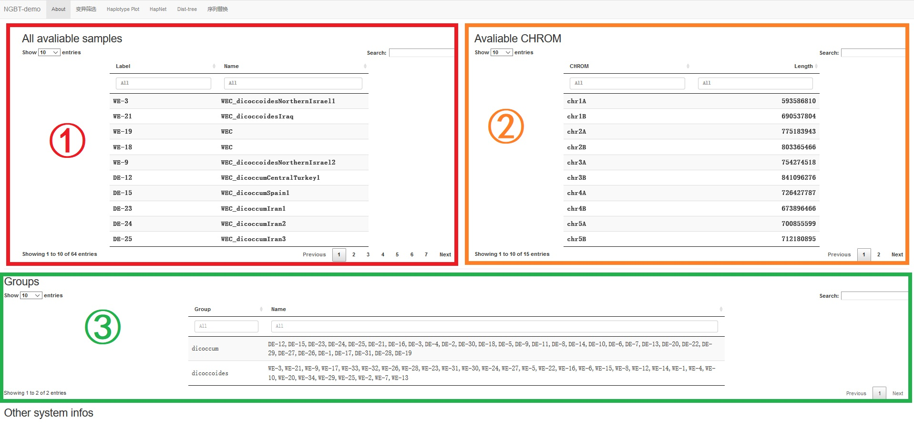

# About

The tag **About** is the first tag, shows the state of the setups.

In part Ⅰ, the table shows the label, which is one that could be used as the input in later tags, along with the full name of all the avaliable samples. Part Ⅱ shows all the avaliable chromosomes, by their name and length. Part Ⅲ shows all the groups pre-defined by your adminsitrator. First column is the name of groups, and second is the labels of samples belong to it.

All these 3 tables can be searched (right upper) or filtered (top of each column).

When you forget what to input, nor how to input, check here.