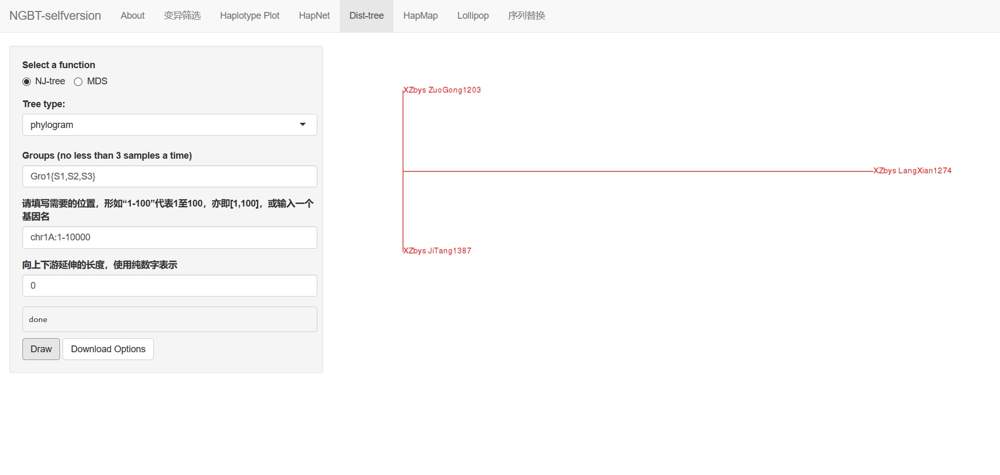

# Dist-tree

Dist-tree introduction here.

## UI

- Most of the functions here are same as `Haplotype Plot`.

- **Select a function**: select to draw tree or MDS(INTRODUCTION).

- **Tree type**: when select `tree` former, then choose a tree type here.

- **Groups**: mostly are same as `Haplotype Plot`. **But**, make sure the totall samples here should be **no less than 3**, otherwise there will raise error.