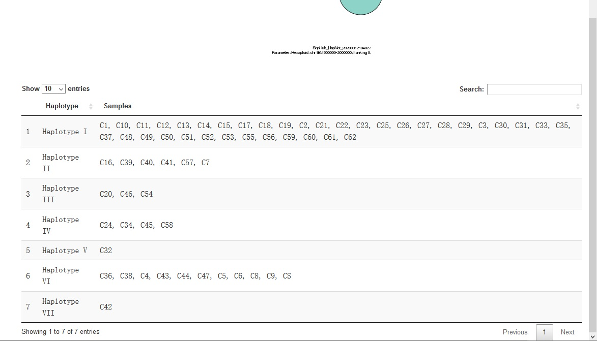

# HapNet

Haplotype networks represent the relationships among the different haploid genotypes observed from the sample list based on package *pegas*. For more information about haplotype, see [here](http://markscherz.tumblr.com/post/80597912898/haplotypes-and-understanding-haplotype-networks) or [here](http://phylonetworks.blogspot.com/2013/09/how-do-we-interpret-rooted-haplotype.html)

## Panel ① on the left provides severial options:
- **Groups**: samples that divided into group(s) are wanted. Three ways are avaliable as well.
	- Pure sample name group list. Assume that we have samples `S1,S2,S3,S4`, and `S1,S2` are in a group called `G1`, while `S3,S4` in `G2`, a string like `G1{S1,S2},G2{S3,S4}` could be used as an input.
	- Pure group list. Assume that we have two pre-defined groups called `PG1` and `PG2`, a string like `PG1,PG2` could be used as an input.
	- Mixed list. String like `G1{S1,S2},PG1,PG2,G2{S3,S4}` is also able to use as an input.
	- **Make sure** that `S1`, `S2`, `S3` and `S4` should **NOT** be contained in neither `PG1` nor `PG2`.

- **Region**: a region is wanted here. Input format should be `chr:from-to`, like `chr1A:1-100`. You could find all the avaliable chromsomes and their maximum length in `SampleInfo` panel. Also, gene name is acceptable.

- **Flanking region length**: when using the gene name as input, you may want some extra length in the upstream and downstream. Both ends of the region will be extended by the value here.

- **Draw**: click when getting all options ready.

## Download Options

Click the **Download Options** button, and then you can select format, width and height of the plot shown as the result. Then, click `Download` to download it.

## Details

There is a table below the plot, showing samples in each haplotype drawn in the plot.