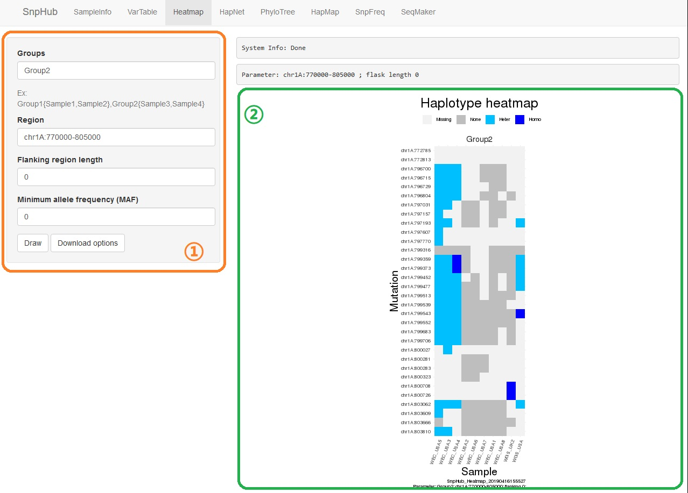

# Heatmap

Haplotype heatmap provides a more clear way to analyze mutation type through different samples. It's easy to find out which samples are similar in a particular region, for they have the same color in the region.

## Panel ① on the left provides severial options:
- **Groups**: samples that divided into group(s) are wanted. You can define your own group here, by inputing `self-group-name-1{sample1,sample2},self-group-name-2{sample3}`, which means we inputed two groups whose names are "self-group-name-1" and "self-group-name-2". Self-group-name-1 contains sample1 and sample2, while self-group-name-2 contains sample3. You can also use pre-defined groups, by inputing `pre-defined-group-name-1,pre-defined-group-name-2`. **Note** that you could use only **one** type of them, self-defined group or pre-defined group.

- **Region**: a region is wanted here. Input format should be `chr:from-to`, like `chr1A:1-100`. You could find the avaliable chromsomes and their length in `SampleInfo` panel. Also, gene name is acceptable.

- **Flanking region length**: when you want to use the gene name as region, you may want some extra postions in the upstream or downstream. Value here is simply added to the maximum , and subtracted from the minimum of the region.

- **Minimum allele frequency (MAF)**: Minor allele frequency (MAF) is the frequency at which the second most common allele occurs in a given population. Larger the value is, lesser the result postions are. If the value is 0 (by default), this filter function is disabled.

- **Draw**: click after fulfill options, and panel ② will display the plot (if every settings are correct).

## Download Options

Click the **Download Options** button, and then you can select the format, the width, the height of the file you download. Then, click `Download` to download the plot.
