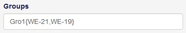
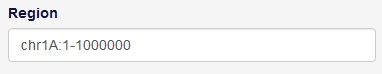

# Basic Usage

In this section, we will introduce every function of the SnpHub, and explain how to use them.

When you open Snphub in the browser, you may see the page like the picture below.

Basically, we can devide the whole page into two parts:
- ①: Tags. The content will switch to the tagged function by clicking them.
- ②: Content. Which is the main panel where you actually use the application.

In the content part of the page, you may found the input panal on the left, in most of the tags. Some of the inputs are similar, and, of course, some are not.

When the textbox has a title of "**Samples**", that means sample names are wanted here. For example, you could input `sample1,sample2,sample3`. Also, if a sample group has been defined by the administrator, which you could see in the `SampleInfo` panel, and all samples in a particular group are needed, you could use `#pre-defined-group-name-1` to add all of the samples in the group pre-defined-group-name1. **NOTE** that a hash mark is needed because the input shoud be **samples** rather than **groups**.

When the textbox has a title of "**Groups**, that means **not only** sample names are wanted here, but they also should be divided into groups. You can define your own group here, by inputing `self-group-name-1{sample1,sample2},self-group-name-2{sample3}`, which means we inputed two groups whose names are "self-group-name-1" and "self-group-name-2". Self-group-name-1 contains sample1 and sample2, while self-group-name-2 contains sample3. You can also use pre-defined groups, by inputing `pre-defined-group-name-1,pre-defined-group-name-2`. **Notice** that you could use only **one** type of them, self-defined group or pre-defined group.

When the textbox has a title of "**Region**, that means a region is wanted here. Input format should be `chr:from-to`, like `chr1A:1-100`. You could find the avaliable chromsomes and their length in `SampleInfo` panel. Also, gene name is acceptable.

We will talk about more details in the later tutorial.