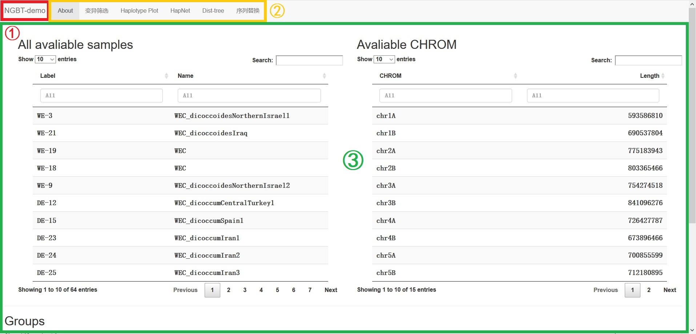

# Basic Usage

In this section, we will introduce every functions of the NGBT, and explain how to use them.

When you open NGBT in the browser, you may see the page like the picture below.

Basically, we can devide the whole page into three parts:
- ①: The name of the application, which is NGBT.
- ②: Tags. By clicking them, the content will switch to the tagged function.
- ③: Content. Here is the main panel where you actually use the application.

In the part of tags, as you can see, there're 6 of them that can be clicked. The current displayed tag is marked by a light shadow. In the picture, it's the **About** tag that is selected by now, and it looks slightly different to others.

We will talk about more details in the later tutorial.