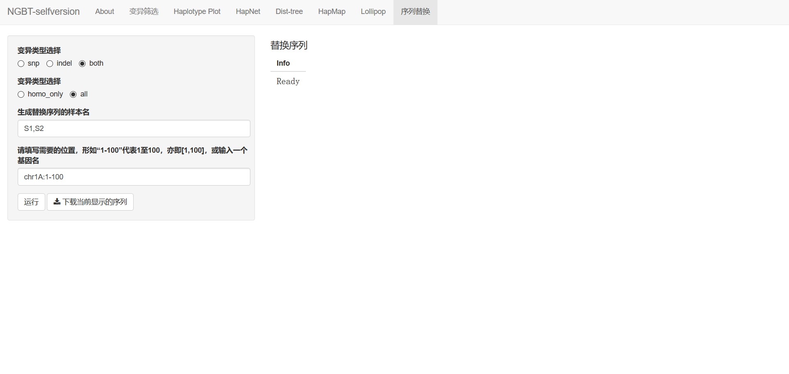

# sequence maker

In this tag, you can get the sequence of some samples by exchanging the mutation to the reference genome.

## UI

Options here are pretty simple.

- **Variation Type**: to choose weather to exchange snp or indel variation only, or to exchange all variations.

- **Mutation type**: choose weather to change homozygous mutation only.

- **Samples**: mostly the same to `variation subset`. Moreover, you can use `#RAW` as a sample name to get raw reference genome sequence.

- **Regions**: same as `variation subset`.
