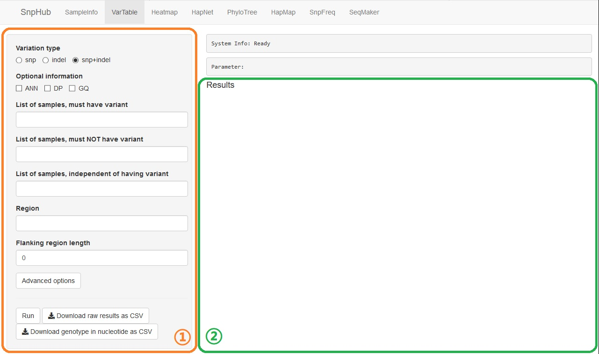
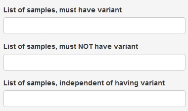
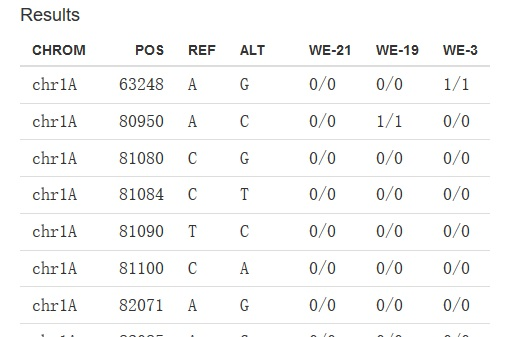
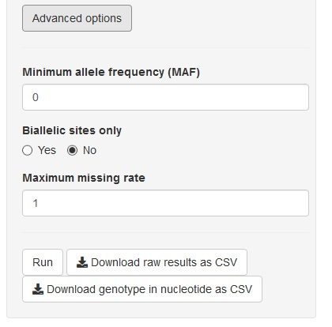

# VarTable

There are 2 panels: the left one (①) is the input panel, and the right one is the result display panel.

This function subsets the VCF file by the parameters given in the left panel (①), and returns the result on the right as a table.

**Note** that all the conditions are connected by **logic AND (&&)**

## Fill the parameters:

- **Variation Type**: select one of the three ratios that represent `SNP (Single Nucleotide Polymorphism) only`, `indel (input/delete) only` or `SNP + indel`.

- **Optional information**: there are 3 check boxes, deciding additional informations. For more information, check the [vcf format document](https://samtools.github.io/hts-specs/VCFv4.2.pdf).

- **Samples**: **sample names** are wanted here.
	- Basically, there are three ways avaliable to input:
		- Pure sample name list. Sample names are divided by "`,`", like `sample1,sample2,sample3`.
		- Pure group list. Use a *#* before group name to transfer group into sample name list, like `#pre-defined-group-name-1,#pre-defined-group-name-2`. 
		- Mixed list. Something looks like `sample1,sample2,sample3,#pre-defined-group-name-1`.
	- **List of samples, must have variant**: samples here will be asked to have mutations in the result. If they do not have mutation in some sites, these sites won't appear in result.
	- **List of samples, must NOT have variant**: contrary to the former, sites which samples here have mutations will be deleted in result.
	- **List of samples, independent of having variant**: samples here won't be dealed, just display.

- **Region**: a region is wanted here. Input format should be `chr:from-to`, like `chr1A:1-100`. You could find all the avaliable chromsomes and their maximum length in `SampleInfo` panel. Also, gene name is acceptable.

- **Flanking region length**: when using the gene name as input, you may want some extra length in the upstream and downstream. Both ends of the region will be extended by the value here.

- **Advanced Options**: click this button to show/hide some advanced options. **Note** that when these options are hide, they **won't** affect the result.

## RUN, and Download

Click the `Run` button when getting all options ready. Table on the right will show the result of subsetting, or some error message if the parameters are wrong.

Click `Download raw results as csv` to download current result table as `.csv` file.

Click `Download genotype in nucleotide as csv` to download a `.csv` file, contains the genotype in nucleotide.

## Advanced Options

Click the button `Advanced Options`, then some more options will appeare.**Note** that when these options are hidden, they **won't** affect the result.

- **Minimum allele frequency (MAF)**: Minor allele frequency (MAF) is the frequency at which the second most common allele occurs in a given population. Larger the value is, lesser sites will be in result. If the value is 0 (by default), this filter function is disabled.

- **Biallelic sites only**: A **biallelic** site is a specific locus in a genome that contains two observed alleles, counting the reference as one, and therefore allowing for one variant allele. A **multiallelic** site is a specific locus in a genome that contains three or more observed alleles, again counting the reference as one, and therefore allowing for two or more variant alleles. Select `Yes`, all postions in the result that have multiallelic will be deleted.

- **Maximum missing rate**: filter option of maximum missing rate.